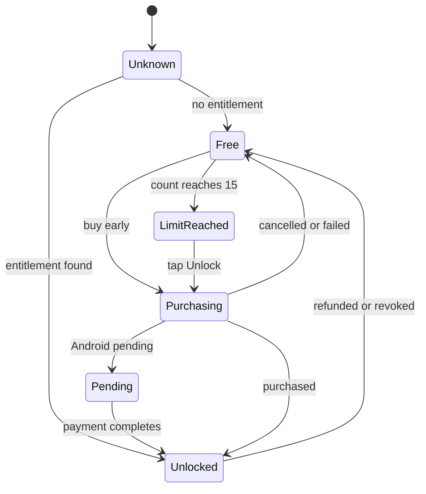

# Billing and entitlements (v0)

Normative for `InvoiceBilling` (iOS) and `:core:billing` (Android). Decision record: ADR-0008.

## Product

| | iOS (StoreKit 2) | Android (Play Billing Library 8+) |
|---|---|---|
| Type | Non-consumable | One-time product (non-consumable) |
| Product ID | `<appId>.unlimited_invoices` | the same ID |
| Price | Set per storefront in App Store Connect | Set per country in Play Console |
| Family Sharing | On | n/a |

**One product ID on both stores:** `<appId>.unlimited_invoices`, where `<appId>` is the bundle / application ID
(e.g. `app.invoicebuilder.unlimited_invoices`), fixed when the app ID is chosen. Lowercase letters, digits, `.` and `_`
satisfy both stores; App Store product IDs must be unique across the whole developer account, Play IDs per app.

Prices always come from the store (`Product.displayPrice` / `ProductDetails.oneTimePurchaseOfferDetails.formattedPrice`);
the app never hard-codes a price.

## Free tier

- `FREE_LIMIT = 15` issued **invoices** per user, lifetime. Drafts and quotes never count.
- The counter increments inside the `IssueDocument` transaction and **never decreases** (void/delete do not refund).
- Effective count = `max(local counter, device_state.free_counter_mirror, issued invoices visible in the database)`.
  The last term makes iCloud-synced devices share the limit.
- Mirrors: iOS Keychain item (`invoicebuilder.freeCounter`, not synchronizable); Android Block Store (best effort).
  After each issue the mirror is raised to the effective count (never lowered); at launch it is one of the inputs.
- "Issued invoices visible in the database" counts every invoice that was ever issued: `doc_type = 'invoice'` and
  `lifecycle <> 'draft'`, voided and tombstoned ones included.
- At the limit only **Issue invoice** is locked. Viewing, editing, sharing, exporting, backups, quotes and drafts
  keep working. The paywall opens from the Issue action and from Settings.

## State machine

`Free` re-evaluates the count on entry, so a cancelled purchase at the limit lands on `LimitReached`.

### Transitions — `EntitlementMachine.next(state, event, count)`

`count` is the effective count (above). "By count" means `limitReached` when `count ≥ FREE_LIMIT`, else `free`.
Events that a state does not list leave it unchanged. Proven by `fixtures/billing/*.json` (kind `billing`).

| Event | From | To |
|---|---|---|
| `resolved(owned: true)` | any | `unlocked` |
| `resolved(owned: false)` | `unknown`, `unlocked` (a refund seen at launch) | by count |
| `resolved(owned: false)` | `free`, `limitReached` | by count (re-evaluated) |
| `counted` (an invoice was issued, or synced devices raised the count) | `free`, `limitReached`, `unknown` | `unknown` stays; others by count |
| `purchaseStarted` | `free`, `limitReached` | `purchasing` |
| `purchasePending` (Ask to Buy, Android pending) | `purchasing` | `pending` |
| `purchased` (verified transaction, from the purchase or the updates listener) | any | `unlocked` |
| `purchaseCancelled`, `purchaseFailed` | `purchasing`, `pending` | by count |
| `revoked` (refund, revocation, Family Sharing removed) | `unlocked` | by count |

**Issuing an invoice is allowed** when the state is `unlocked` or `count < FREE_LIMIT` — in every state, so an
unresolved or pending store never blocks someone below the limit. `remaining = max(FREE_LIMIT − count, 0)`.
`Unknown` resolves on launch from the platform's cached entitlements (works offline); the last known state is cached
in `app_state` (`entitlement`) only to avoid UI flicker, never as the source of truth.

## Platform rules

**iOS**
- On launch: iterate `Transaction.currentEntitlements`; start a `Transaction.updates` listener for the app's lifetime.
- Verify each `VerificationResult`; ignore unverified transactions.
- `revocationDate != nil` → revoke. Ask to Buy → `Pending`-like UI ("Waiting for approval"), no unlock.
- "Restore purchases" button → `AppStore.sync()` (required by App Review for non-consumables).
- Always `finish()` verified transactions after updating state.

**Android**
- `BillingClient` with `enablePendingPurchases(...)` and automatic service reconnection.
- On start and on every resume: `queryPurchasesAsync(INAPP)`; product absent → not owned (covers refunds).
- Unlock only on `Purchase.PurchaseState.PURCHASED`; `PENDING` (UPI/cash) shows "Payment pending".
- **Acknowledge** every `PURCHASED`, unacknowledged purchase (`acknowledgePurchase`) — Google auto-refunds after 3 days.
  A startup sweep acknowledges anything missed.
- "Refresh purchases" button re-runs the query (parity with iOS restore).

## Test matrix (Phase 5 / 7c definition of done)

| Scenario | iOS | Android |
|---|---|---|
| Buy at limit → unlocked, can issue | StoreKit config + sandbox | License tester |
| Cancel purchase → back to limit | ✓ | ✓ |
| Ask to Buy / pending → no unlock until approved/paid | Ask to Buy in StoreKit test | Pending test card |
| Restore on second device / reinstall | `AppStore.sync()` | Auto on start |
| Refund / revoke → free again | StoreKit test refund | Refund in Play Console |
| Offline launch after purchase stays unlocked | ✓ | ✓ |
| Counter survives reinstall (best effort) | Keychain | Block Store |
